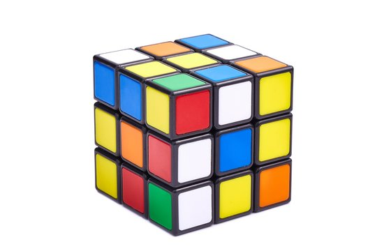

# Rubik Cube
[WIKIPEDIA](https://de.wikipedia.org/wiki/Zauberw%C3%BCrfel)

## Short Description
The Rubik's Cube is a **3D puzzle** invented by Ernő Rubik in 1974. It is a cube-shaped device that is made up of smaller cubes called "cubies". Each of the six faces of the cube can be rotated independently, which allows for a large number of possible combinations.
## How to solve the cube

Solving the Rubik's Cube can be a challenging task, but with practice and patience, it can be done. There are many different methods for solving the cube, but one popular method is the "layer-by-layer" method, which involves solving the cube one layer at a time.

Here are the basic steps for solving the cube using the layer-by-layer method:

1.  Solve the first layer. Start by solving the first layer of the cube, which involves creating a cross on the first layer and then filling in the corners.

2.  Solve the second layer. Once the first layer is solved, move on to the second layer, which involves solving the middle layer of the cube.

3.  Solve the third layer. The final layer is the most challenging, and involves solving the top layer of the cube while preserving the first two layers.

 ### Supported Cube Sizes
 The Rubik's Cube comes in different sizes, with the **3x3x3** being the most common and well-known. However, there are also larger cubes such as the **4x4x4** (also known as the Rubik's Revenge), the **5x5x5** (also known as the Professor's Cube), and even cubes with odd numbers of layers, such as the **7x7x7**.
 
 [Dana Vlas](https://github.com/vlasdana/)

