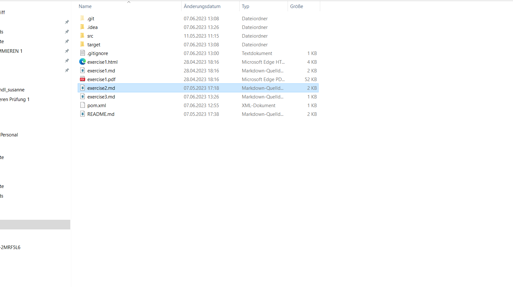
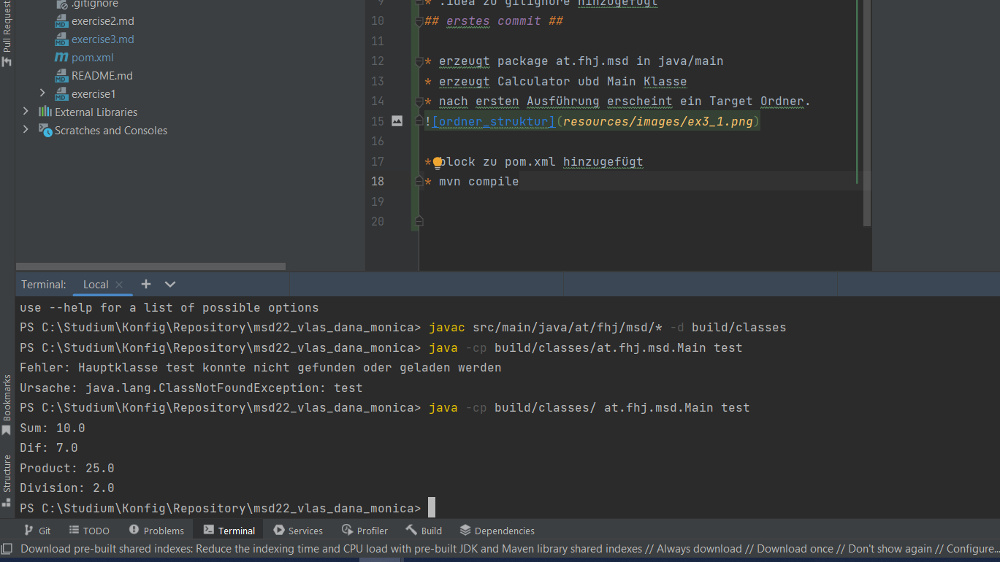

# Exercise 3
## Dokumentation ##

### Maven Install ##

* neues Java Projekt erstellt
* .idea zu gitignore hinzugefügt
## erstes commit ##

* erzeugt package at.fhj.msd in java/main
* erzeugt Calculator ubd Main Klasse
* nach ersten Ausführung erscheint ein Target Ordner.

* block zu pom.xml hinzugefügt
* mvn compile
* compiled java-files in class-files mit javac <fil> -d build/classes
* ausführen in der Console java -cp build/clases <package.ClassName> test
* 
